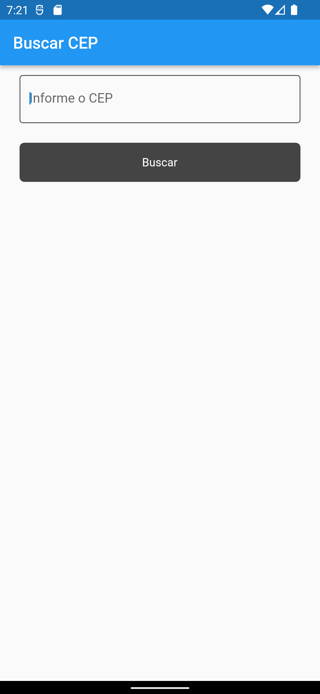
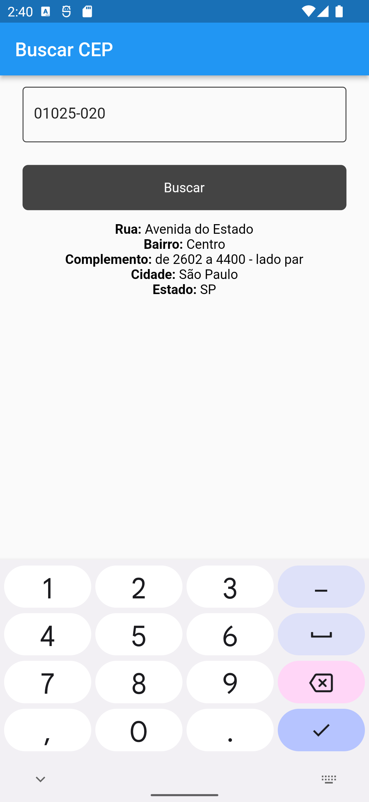
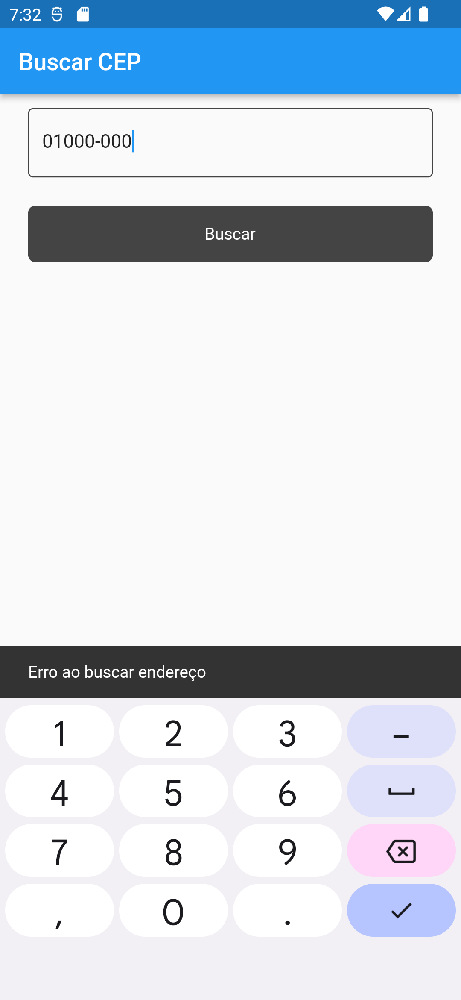

# flutter_cep

## commands

    flutter create --project-name flutter-cep --platforms web, android ./flutter-cep

    flutter pub run build_runner watch - d

## packages

- [dio](https://pub.dev/packages/dio)
- [bloc](https://pub.dev/packages/bloc)
- [flutter_b_loc](https://pub.dev/packages/flutter_bloc)
- [match](https://pub.dev/packages/match)
- [valitorless](https://pub.dev/packages/validatorless)
- [mask_text_input_formatter](https://pub.dev/packages/mask_text_input_formatter)

## screens

 

    
    
    

